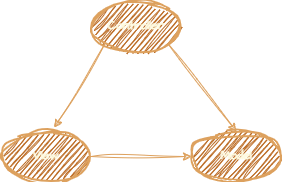
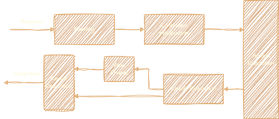

# Architecture ❤🚀

**Links:**

- [ASP.NET MVC](https://github.com/SMitra1993/theNETInterrogation/blob/master/14%20-%20Exception.md#exception--1)
- [MVC Architecture](https://github.com/SMitra1993/theNETInterrogation/blob/master/14%20-%20Exception.md#exception--1)

## **ASP.NET MVC:**

ASP.NET MVC (Model-View-Controller) is an open-source web application framework developed by Microsoft. It enables developers to build dynamic, data-driven web applications using the Model-View-Controller architectural pattern. ASP.NET MVC provides a structured approach to developing web applications by separating concerns into three main components:

1. **Model**: Represents the application's data and business logic. It encapsulates the application's data structures, business rules, and interactions with the database or other data sources.

2. **View**: Represents the presentation layer of the application. It is responsible for rendering the user interface and displaying data to the user. Views are typically HTML templates combined with server-side code (e.g., Razor syntax) to generate dynamic content.

3. **Controller**: Acts as an intermediary between the Model and the View. It handles user input, processes requests, and updates the Model accordingly. Controllers contain action methods that respond to specific HTTP requests and perform corresponding actions, such as retrieving data, updating records, or rendering views.

Key features of ASP.NET MVC include:

- **Separation of Concerns**: ASP.NET MVC separates the application logic into distinct components, making it easier to manage and maintain code.

- **Routing**: ASP.NET MVC uses routing to map incoming URL requests to specific Controller actions, providing clean and customizable URLs for web applications.

- **Extensibility**: ASP.NET MVC is highly extensible, allowing developers to customize and extend the framework to meet the requirements of their applications.

- **Testability**: ASP.NET MVC promotes test-driven development by facilitating unit testing of Controllers and Models, leading to more robust and reliable code.

- **Integration with ASP.NET Core**: ASP.NET Core MVC is the latest version of the ASP.NET MVC framework, designed to run on the cross-platform .NET Core runtime.

Overall, ASP.NET MVC provides a powerful and flexible framework for building modern web applications with rich user interfaces and robust backend functionality. It is widely used by developers to create scalable, maintainable, and high-performance web applications for various industries and domains.

## **MVC Architecture:**

ASP.NET MVC (Model-View-Controller) is a framework for building web applications using the Model-View-Controller architectural pattern. It separates the application into three main components: Model, View, and Controller. Here's a detailed description of each component:

1. **Model (M)**:
   - The Model represents the application's data and business logic.
   - It encapsulates the application's data, such as database entities, data structures, and business rules.
   - Models are responsible for managing data persistence, retrieval, validation, and manipulation.
   - Models can interact with databases, web services, or any other data source to fetch or store data.
   - In ASP.NET MVC, Models are typically represented by classes or data structures that define the structure and behavior of the application's data.

2. **View (V)**:
   - The View represents the presentation layer of the application.
   - It's responsible for rendering the user interface and displaying data to the user.
   - Views are typically HTML templates or markup files combined with server-side code (e.g., Razor syntax in ASP.NET MVC) to generate dynamic content.
   - Views receive data from the Controller and present it to the user in a user-friendly format, such as web pages, forms, or reports.
   - Views are passive components and should not contain business logic. They focus solely on presenting data to the user in a readable format.

3. **Controller (C)**:
   - The Controller acts as an intermediary between the Model and the View.
   - It handles user input, processes requests, and updates the Model accordingly.
   - Controllers receive requests from the client, such as HTTP requests, and determine which actions to perform.
   - Controllers orchestrate the flow of data between the Model and the View, passing data from the Model to the View for rendering.
   - Controllers contain action methods, which are responsible for responding to specific HTTP requests and performing corresponding actions, such as retrieving data, updating records, or rendering views.
   - In ASP.NET MVC, Controllers are implemented as classes that inherit from the `Controller` base class and contain action methods decorated with attributes to define routing and request handling.



In ASP.NET MVC, the flow of data and control follows a predefined pattern:
- The client sends a request to the server, specifying a URL.
- The ASP.NET MVC framework maps the URL to a Controller and action method.
- The Controller retrieves data from the Model, performs any necessary processing, and prepares it for presentation.
- The Controller selects a View and passes the processed data to the View.
- The View renders the HTML content based on the provided data.
- The rendered HTML is sent back to the client as a response.

This separation of concerns allows for better organization, maintainability, and testability of web applications. It promotes code reusability, modularization, and scalability, making it easier to manage complex web projects.

## **ASP.NET MVC Folder Structure:**

Let's dive deeper into each folder in the ASP.NET MVC project structure:

1. **App_Data**:
   - This folder typically stores data files such as databases (e.g., SQL Server `.mdf` files), XML files, or other data sources required by the application.
   - It's often used for local data storage or for holding files that the application needs to read or write at runtime.

2. **App_Start**:
   - Contains classes that are executed when the application starts.
   - Commonly includes configuration files:
     - `RouteConfig.cs`: Configures URL routing rules for the application.
     - `FilterConfig.cs`: Registers global filters for the application (e.g., authorization, exception handling).
     - `BundleConfig.cs`: Bundles and minifies CSS, JavaScript, or other static files for optimized delivery.
     - `AuthConfig.cs`: Configures authentication and authorization settings.

3. **Content**:
   - Holds static files such as CSS stylesheets, images, and fonts that are used by the application's views.
   - These files are typically referenced from the views to style the user interface.

4. **Controllers**:
   - Contains Controller classes that handle user requests and generate responses.
   - Each Controller typically contains action methods that respond to specific HTTP requests (e.g., GET, POST).

5. **Models**:
   - Contains classes that represent the data model of the application.
   - These classes encapsulate the application's data structures, business logic, and interactions with the database or other data sources.
   - Models may also include data validation attributes and logic.

6. **Scripts**:
   - Contains client-side scripts such as JavaScript files used by the application.
   - These files are typically referenced from the views to add dynamic behavior to the user interface.

7. **Views**:
   - Represents the presentation layer of the application.
   - Views are HTML templates combined with server-side code (e.g., Razor syntax) to generate dynamic content.
   - Organized into folders corresponding to Controllers to maintain a clean separation of concerns.
   - The `Shared` folder contains shared views and partial views that are used across multiple pages of the application.

8. **Areas**:
   - An optional folder used to organize large applications into distinct functional areas.
   - Each area can have its own Controllers, Models, and Views, allowing for better organization and separation of concerns.

9. **App_GlobalResources** and **App_LocalResources**:
   - Used for localization and globalization of the application.
   - Resource files (.resx) contain localized strings, messages, and other resources used in the application.

10. **bin**:
    - Contains compiled binary files (.dll) of the application, including third-party libraries and dependencies.
    - These files are automatically generated during the build process.

11. **Properties**:
    - Contains project-specific properties and settings files.
    - Includes files like `AssemblyInfo.cs` for specifying assembly-level metadata.

12. **Global.asax** and **web.config**:
    - `Global.asax` contains application-level events and settings, such as `Application_Start` and `Session_Start`.
    - `web.config` is the configuration file for the ASP.NET application, holding settings such as connection strings, authentication settings, and application-level configurations.

This breakdown provides a detailed understanding of the purpose and contents of each folder in the ASP.NET MVC project structure, facilitating efficient development and maintenance of web applications.

## **ASP.NET MVC Life Cycle:**

The application lifecycle and request lifecycle in ASP.NET MVC represent the sequence of events that occur from the application startup to handling an individual HTTP request. Here's a detailed explanation of each:

### Application Lifecycle:

1. **Application Start**:
   - When the application is started or restarted (e.g., after deployment or IIS reset), the Application_Start event is raised in the Global.asax file.
   - Initialization tasks such as registering routes, configuring dependency injection, and setting up logging are performed here.

2. **Request Handling**:
   - The application waits for incoming HTTP requests.
   - Each request is processed independently and follows its own request lifecycle.

3. **Application End**:
   - When the application is shut down or restarted, the Application_End event is raised in the Global.asax file.
   - Cleanup tasks such as releasing resources, closing connections, and saving application state may be performed here.

### Request Lifecycle:

1. **Routing**:
   - The incoming URL is mapped to a controller and action method using the routing configuration.
   - Route parameters are extracted from the URL, and a route handler is selected to process the request.

2. **Controller Execution**:
   - The selected controller is instantiated, and the appropriate action method is invoked.
   - The controller performs any necessary processing, such as retrieving data from models or services.

3. **Action Filters**:
   - Action filters are executed before and after the action method execution.
   - They can intercept the request, perform pre-processing or post-processing tasks, and modify the action result.

4. **Model Binding**:
   - Data from the request (e.g., form fields, query string parameters) is bound to action method parameters or model properties.
   - Model validation may be performed based on data annotations or custom validation logic.

5. **Action Method Execution**:
   - The action method executes the business logic, typically interacting with models or services to retrieve or manipulate data.
   - The action method returns an action result, which represents the response to the client.

6. **View Rendering**:
   - If the action result is a view result, the corresponding view template is rendered. If not, then the action result will execute on its own and produces a response to the client.
   - The view template generates HTML markup based on the provided model data.

7. **Response**:
   - The rendered HTML or other content is sent back to the client as an HTTP response.
   - Additional headers, cookies, or status codes may be set based on the action result.



Below is a detailed comparison of the Application Life Cycle and the Request Life Cycle in ASP.NET in a tabular form:

| Aspect                   | Application Life Cycle                                          | Request Life Cycle                                             |
|--------------------------|-----------------------------------------------------------------|----------------------------------------------------------------|
| **Definition**           | The entire lifespan of an application from start to end.        | The entire process from receiving an HTTP request to sending a response. |
| **Start**                | Begins when the application is first started or when the first request is made to the application. | Begins when an HTTP request is received by the application.    |
| **End**                  | Ends when the application is stopped or restarted.              | Ends when the HTTP response is sent back to the client.        |
| **Phases**               | - Application Start <br> - Application Initialization <br> - Application End | - BeginRequest <br> - AuthenticateRequest <br> - AuthorizeRequest <br> - ResolveRequestCache <br> - MapRequestHandler <br> - AcquireRequestState <br> - PreRequestHandlerExecute <br> - ExecuteRequestHandler <br> - PostRequestHandlerExecute <br> - ReleaseRequestState <br> - UpdateRequestCache <br> - EndRequest |
| **Main Events**          | - `Application_Start` <br> - `Application_End`                  | - `BeginRequest` <br> - `AuthenticateRequest` <br> - `AuthorizeRequest` <br> - `ResolveRequestCache` <br> - `MapRequestHandler` <br> - `AcquireRequestState` <br> - `PreRequestHandlerExecute` <br> - `PostRequestHandlerExecute` <br> - `ReleaseRequestState` <br> - `UpdateRequestCache` <br> - `EndRequest` |
| **Key Components**       | - Global.asax <br> - Application Domain                        | - HTTP Handlers <br> - HTTP Modules <br> - ASP.NET Pipeline    |
| **Usage**                | Manages the overall application-level events.                  | Manages the events for a single HTTP request.                 |
| **Example Events**       | - `Application_Start`: Triggered when the application starts. <br> - `Application_End`: Triggered when the application ends. | - `BeginRequest`: Triggered at the beginning of each request. <br> - `EndRequest`: Triggered at the end of each request. |
| **Application State**    | Maintained across all requests until the application is stopped. | Specific to each request, does not maintain state across requests. |
| **Error Handling**       | - `Application_Error`: Used to handle global application errors. | - `Error`: Can be handled within the request life cycle events. |
| **Initialization**       | Application-level initialization code is executed once.        | Initialization specific to the request is executed for each request. |
| **Resource Management**  | Manages resources that are shared across the entire application. | Manages resources specific to the individual request.          |

### Example Scenario for Application Life Cycle:

- **Application_Start**: This event is used to initialize application-wide settings and resources. For instance, you might load configuration settings or initialize application-level caches.

    ```csharp
    protected void Application_Start()
    {
        // Code that runs on application startup
        // Example: Initialize application-level cache
        Cache["ConfigSettings"] = LoadConfigSettings();
    }
    ```

### Example Scenario for Request Life Cycle:

- **BeginRequest**: This event is fired when an incoming request is received. It is often used for logging or for implementing custom authentication logic.

    ```csharp
    protected void Application_BeginRequest(Object sender, EventArgs e)
    {
        // Code that runs at the beginning of each request
        // Example: Log the incoming request URL
        string requestUrl = HttpContext.Current.Request.Url.ToString();
        Logger.Log("Incoming request: " + requestUrl);
    }
    ```

In summary, the **Application Life Cycle** manages events and states that are global to the entire application, such as application startup and shutdown. On the other hand, the **Request Life Cycle** deals with the processing of individual HTTP requests, handling tasks like authentication, authorization, and request handling on a per-request basis. Understanding both life cycles is crucial for effectively managing resources, handling errors, and implementing robust web applications in ASP.NET.

## **Action Method Execution Flow:**

1. **ControllerExecute()**
   - **Action Invoker Selects Method**: The entry point where the framework identifies and selects the appropriate action method to handle the incoming request. This is based on the routing data (URL, HTTP method, etc.).

2. **Authentication Filters**
   - These filters ensure the user is authenticated. If authentication fails, the process is short-circuited, and the user is redirected or challenged as appropriate.
   - **Failure**: If authentication fails, the process terminates here, and an appropriate response (e.g., redirect to login) is sent.

3. **Authorization Filters**
   - These filters check if the authenticated user has permission to access the requested resource. If authorization fails, the process is short-circuited, and the user is notified accordingly.
   - **Failure**: If authorization fails, the process terminates, and a response indicating lack of permissions (e.g., 403 Forbidden) is sent.

4. **Model Binding**
   - This step involves binding the incoming request data (e.g., form fields, query parameters) to the parameters of the action method.
   - **Challenge**: If model binding fails (e.g., invalid data format), the process can be interrupted, and an error response or validation feedback is provided.

5. **Action Filters (OnActionExecuting)**
   - These filters run code before the action method execution. They can be used for tasks like logging, validation, and modifying the request.
   - **Example**: A logging filter logs the details of the incoming request before the action method executes.

6. **Action Method Execution**
   - This is where the actual business logic resides. The action method processes the request and prepares an `ActionResult` (e.g., a view, JSON data, a file).
   - **Example**: The `Index` method in `HomeController` might return a view with a list of products.

7. **Action Filters (OnActionExecuted)**
   - These filters run code after the action method execution but before the result is returned to the client. They can be used for tasks like modifying the response, logging, and handling exceptions.
   - **Example**: A logging filter logs the details of the response after the action method executes.

8. **Result Execution**
   - The `ActionResult` generated by the action method is executed, rendering the appropriate response (e.g., generating HTML for a view, returning JSON data).
   - **Example**: If the `ActionResult` is a `ViewResult`, the view is rendered and the HTML is prepared to be sent to the client.

### Summary:

- **Failure Points**: Authentication and authorization filters can cause the flow to short-circuit, preventing further processing if the user is not authenticated or authorized.
- **Model Binding**: Ensures the incoming data is properly formatted and can be used by the action method.
- **Action Filters**: Provide hooks before and after the action method execution for additional processing.
- **Action Method**: Core business logic and request handling.
- **Result Execution**: Final step where the prepared response is sent back to the client.

This flow ensures that requests are processed securely, efficiently, and consistently, with ample opportunities for customization and handling cross-cutting concerns through filters.

## **View Result Execution Flow:**

The diagram illustrates the steps involved in the execution of an action result in ASP.NET MVC. Here's an explanation of each step in detail:

### Steps in Action Result Execution:

1. **Action Invoker**
   - The process begins with the Action Invoker, which is responsible for invoking the action method and handling the action result.

2. **Result Filters - OnResultExecuting()**
   - **Purpose**: This step involves the execution of result filters before the result is processed.
   - **Function**: Custom logic can be added here to execute right before the action result is processed. This could include logging, modifying the result, or performing additional checks.

3. **Action Result - ExecuteResult()**
   - **Purpose**: This step involves the execution of the action result.
   - **Function**: The action result can be a view result, a partial view result, a redirect result, or any other type of action result. The `ExecuteResult()` method is called to process the action result.

4. **View & PartialView (Branch 1)**
   - **Purpose**: If the action result is a view or partial view, the following sub-steps are performed.
   
   1. **View Engine**
      - **Function**: The view engine is responsible for finding and rendering the appropriate view template. It locates the view file based on the view name and other parameters.
   
   2. **Render View**
      - **Function**: Once the view is located, it is rendered into HTML. This step generates the final HTML response that will be sent to the client.

5. **Write Response (Branch 2)**
   - **Purpose**: If the action result is something other than a view or partial view (e.g., a JSON result, a redirect result), the following step is performed.
   - **Function**: The response is directly written to the output stream. This could involve serializing an object to JSON, redirecting to another URL, or sending any other type of response.

6. **Result Filters - OnResultExecuted**
   - **Purpose**: This step involves the execution of result filters after the result has been processed.
   - **Function**: Custom logic can be added here to execute right after the action result is processed. This could include logging, cleaning up resources, or performing additional operations based on the result.

### Detailed Flow:

1. **Action Invoker**:
   - The `Action Invoker` is the starting point, selecting the action method and determining the result type.

2. **Result Filters - OnResultExecuting()**:
   - Executes before the result is processed. Filters can perform actions like logging or modifying the result.

3. **Action Result - ExecuteResult()**:
   - Core step where the action result is executed.
   - If the result is a view or partial view, it proceeds to the `View Engine`.
   - If the result is not a view, it directly writes the response.

4. **Branch 1 - View & PartialView**:
   - **View Engine**:
     - Finds the view file based on the name and context.
   - **Render View**:
     - Generates HTML from the view file and sends it as the response.

5. **Branch 2 - Write Response**:
   - Directly writes the response for non-view results.

6. **Result Filters - OnResultExecuted**:
   - Executes after the result is processed. Filters can perform actions like logging, resource cleanup, or other post-processing tasks.

### Summary:
- The execution begins with the Action Invoker, followed by pre-execution result filters.
- The action result is then executed, which can branch into rendering a view or directly writing a response.
- Post-execution result filters are then executed, completing the process.

This flow ensures that custom logic can be injected at various points before and after the action result execution, providing flexibility and control over the result processing in ASP.NET MVC.

## **Action Result Execution Process:**

This diagram illustrates the detailed process of how a view is located and rendered in ASP.NET MVC. Each step represents a method or a process involved in finding and rendering a view. Here’s a breakdown of each step:

### Steps in View Rendering:

1. **Action Invoker**
   - **Role**: The Action Invoker is responsible for executing the action method and handling the action result.

2. **ViewResultBase.ExecuteResult()**
   - **Purpose**: This method is called by the Action Invoker to execute the view result.
   - **Function**: This is the starting point for rendering a view. It orchestrates the process of finding and rendering the view.

3. **ViewResult.FindView()**
   - **Purpose**: This method is responsible for finding the view based on the view name and other parameters.
   - **Function**: It calls the view engine to locate the view file. This method abstracts the logic required to find the correct view.

4. **ViewEngine.FindView()**
   - **Purpose**: This method, called by `ViewResult.FindView()`, is part of the view engine responsible for locating the view.
   - **Function**: It searches through the registered view locations to find the view file. It returns a `ViewEngineResult`, which contains information about the view found.

5. **ViewEngineResult**
   - **Role**: Represents the result of the view engine search.
   - **Components**: It contains the view and any other information necessary to render the view.
   - **Flow**: If the view is found, the process continues to the rendering step; otherwise, it may trigger a "view not found" error.

6. **View.Render()**
   - **Purpose**: This method is responsible for rendering the view to the response.
   - **Function**: It generates the HTML output by combining the view template with the data provided by the controller. This HTML is then written to the response stream.

### Detailed Flow:

1. **Action Invoker**
   - Initiates the process by calling the `ExecuteResult` method on the action result, which is typically a `ViewResult`.

2. **ViewResultBase.ExecuteResult()**
   - This method orchestrates the process of finding and rendering the view. It calls `FindView` to locate the view.

3. **ViewResult.FindView()**
   - Responsible for finding the appropriate view. It delegates the search to the view engine.

4. **ViewEngine.FindView()**
   - The view engine searches for the view in its registered locations. It returns a `ViewEngineResult` that contains the view if found.

5. **ViewEngineResult**
   - Holds the result of the search. If a view is found, it proceeds to the rendering step.

6. **View.Render()**
   - The view is rendered into HTML. This HTML is then sent to the client's browser as the response.

### Summary:
- The process begins with the Action Invoker and the `ExecuteResult` method.
- The `FindView` methods in both `ViewResult` and `ViewEngine` are used to locate the view.
- The located view is represented by `ViewEngineResult`.
- Finally, the view is rendered to HTML using the `Render` method.

This flow ensures that the correct view is located and rendered based on the action method's requirements, providing the final HTML response to the client.