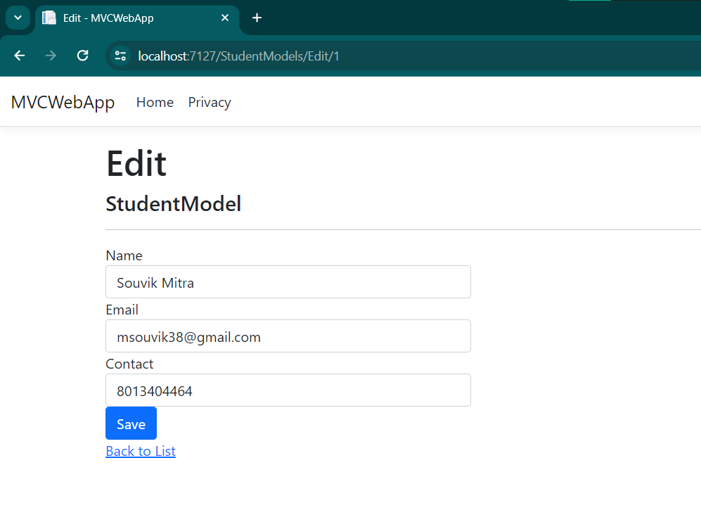

# Scaffloding

## **MVC Scaffolding:**

ASP.NET MVC scaffolding is a code generation framework that automates the process of creating basic CRUD (Create, Read, Update, Delete) operations for your application's data models. It generates the necessary code files, such as controllers, views, and data access code, based on your model classes. Scaffolding simplifies the development process by eliminating repetitive tasks and reducing the amount of boilerplate code you need to write.

Here's a detailed explanation of ASP.NET MVC scaffolding:

### 1. Model:
Scaffolding starts with your data model, which typically represents the structure of your application's data entities. You define your model classes using plain C# (or VB.NET) classes with properties that map to your database tables.

```csharp
public class Product
{
    public int Id { get; set; }
    public string Name { get; set; }
    public decimal Price { get; set; }
}
```

### 2. Controller:
Scaffolding generates controller classes that handle HTTP requests and implement CRUD operations for your model classes. The generated controller includes actions for listing, creating, editing, and deleting records.

```csharp
public class ProductsController : Controller
{
    private readonly ApplicationDbContext _context;

    public ProductsController(ApplicationDbContext context)
    {
        _context = context;
    }

    // GET: Products
    public async Task<IActionResult> Index()
    {
        return View(await _context.Products.ToListAsync());
    }

    // Other CRUD actions (Create, Edit, Delete) are also generated
}
```

### 3. Views:
Scaffolding generates Razor views that provide the user interface for interacting with your data. These views include forms for creating and editing records, as well as views for listing and viewing details of individual records.

```html
@model IEnumerable<Product>

@foreach (var product in Model)
{
    <div>
        <h4>@product.Name</h4>
        <p>@product.Price</p>
    </div>
}
```

### 4. Data Access Code:
If you're using Entity Framework or another ORM (Object-Relational Mapping) framework, scaffolding can generate data access code to interact with your database. This includes code for querying, inserting, updating, and deleting records in your database.

```csharp
public class ApplicationDbContext : DbContext
{
    public DbSet<Product> Products { get; set; }
}
```

### Benefits of Scaffolding:
- **Increased Productivity**: Scaffolding automates repetitive tasks, reducing the amount of manual coding required.
- **Consistency**: Generated code follows consistent patterns and conventions, improving maintainability.
- **Rapid Prototyping**: Scaffolding allows you to quickly create a functional CRUD interface for your data models, making it easier to prototype and iterate on your application.

In summary, ASP.NET MVC scaffolding is a powerful tool for accelerating the development of CRUD functionality in your web applications. It automates the process of creating controllers, views, and data access code, allowing you to focus on implementing your application's business logic rather than writing boilerplate code.

## **Step-by-step process:**

**Step 1: Create New Project:**


**Step 2: Configure the project:**


**Step 3: Details of the Project Structure:**


**Step 4: Hosted application in portal:**


**Step 5: Create a model:**


**Step 6: Create a DB Context:**


**Step 7: Use Scaffolding:**


**Step 8: Add Scaffold Item:**


**Step 9: Add MVC Controller:**


**Step 10: Install packages:**


**Step 11: Controller added:**


**Step 12: StudentModels Folder inside View Folder:**


**Step 13: Update DB Connection String:**


**Step 14: Register Program.cs with Db Context:**


**Step 15: Create Db Initilizer Class to initialize default list:**


**Step 16: Do Database Migration in Package Manager Console:**


**Step 17: Run and host the application in Portal:**


**Step 18: Create new details in portal:**


**Step 19: After creating new details in portal:**


**Step 20: View details in portal:**


**Step 21: Update details in portal:**



**Step 22: After update in portal:**


**Step 23: Delete details in portal:**


**Step 24: After delete in portal:**


**Step 25: View Database table:**


**Step 26: Get details in DB using query:**

